# Exercise 1: Create Safe Travels Agent and Deploy to Microsoft Teams

### Estimated Duration: 30 Minutes

## Overview

In this foundational exercise, you'll create your first AI agent using Microsoft Copilot Studio's Safe Travels template. This is a practical, hands-on introduction to conversational AI that will give you a working travel assistant agent deployed to Microsoft Teams.

The Safe Travels agent will help employees with travel-related questions, policy information, and guidance. You'll see how easy it is to create powerful AI agents using templates, test them thoroughly, and deploy them to your organization's collaboration platform. This exercise focuses on getting you comfortable with the core agent development workflow that applies to any business scenario.

## Objectives

You will complete the following tasks:

- Task 1: Import data tables and navigate to Copilot Studio
- Task 2: Create Safe Travels agent from template  
- Task 3: Test and validate agent functionality
- Task 4: Publish and deploy agent to Microsoft Teams

## Task 1: Import Data Tables and Navigate to Copilot Studio

In this task, you will import the required data tables into your Power Platform environment and navigate to Copilot Studio to begin building your agents.

1. Navigate back to the Power Apps portal, and please switch to the environment that you created earlier.

   

1. Once done, select **Tables (1)** from the left menu and click on **Create with Excel or .CSV file (2)**.

   

   > **Note:** If prompted with a permission message stating you don’t have access, click on **Switch and create**.

   

   > **Note:** If you are directly taken to the **Upload an Excel file** screen, click **Cancel** to return.

   

1. In the next pane, click on **Select from device** and in the pop-up window, select files.

   

1. In the file picker dialog:
   - Navigate to **`C:\datasets\Safe-Travels-Agent-Automate`(1)**.
   - Select **Leave balance Tracker.xlsx (2)**.
   - Click **Open (3)** to add the file.

      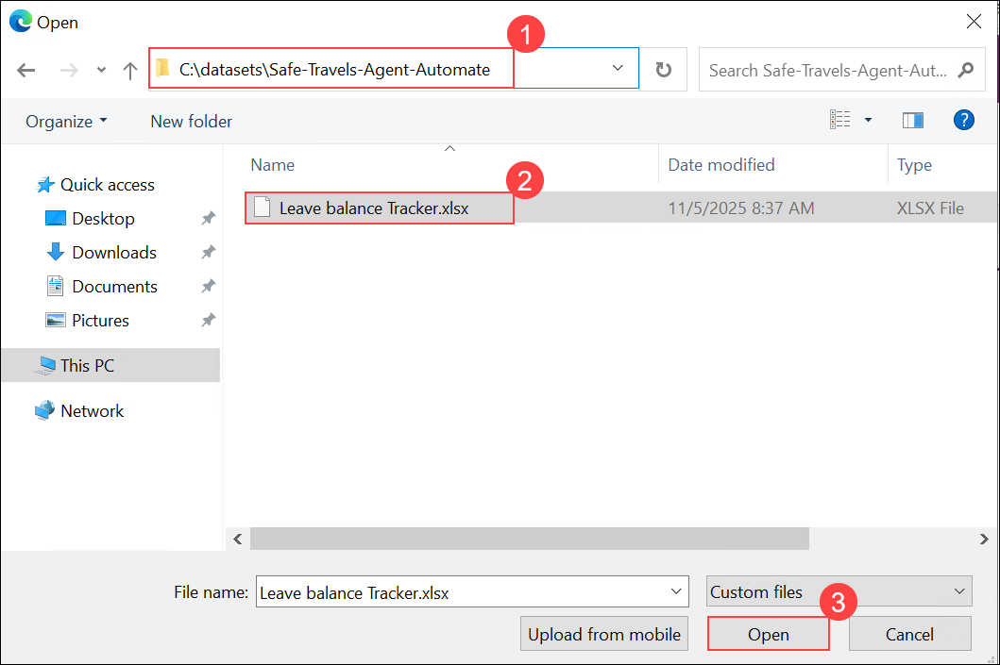

1. In the **Import an Excel or .CSV file** pane, ensure the table is included, and then click **Import**.

   

1. On the table mapping screen, click **Save and exit**.

   

1. In the **Done working?** dialog, click **Save and exit**.

   

1. After provisioning completes, open **Tables (1)** and confirm the **Employee (2)** table is listed; note the logical **prefix (3)** which uniquely identifies the table for future automation (not used further in this lab).

   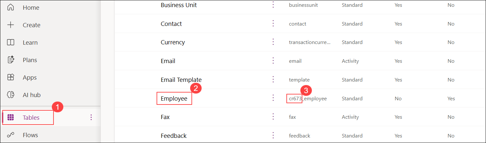

   > **Tip:** If the **Employee** table isn't visible, verify you've switched to **ODL_User <inject key="Deployment ID" enableCopy="false"></inject>'s Environment**.

1. Navigate to **Microsoft Copilot Studio** by opening a new browser tab and using the link below:

   ```
   https://copilotstudio.microsoft.com
   ```

1. On the **Welcome to Microsoft Copilot Studio** screen, keep the default **country/region** selection and click **Get Started** to continue.

   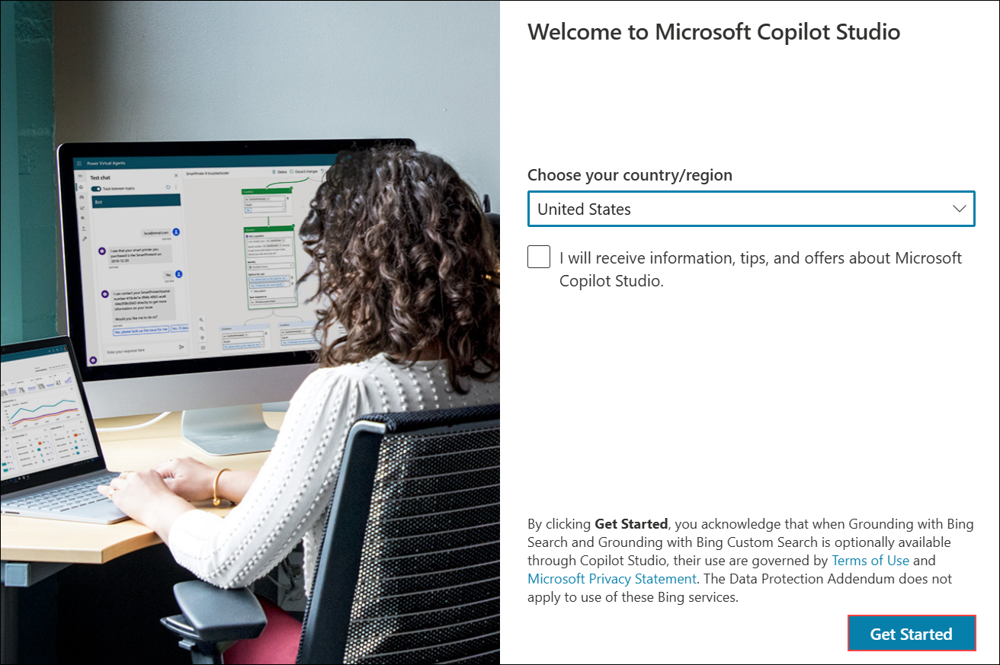

1. If the **Welcome to Copilot Studio!** pop-up appears, click **Skip** to continue to the main dashboard.

   

1. In Copilot Studio, open the environment picker **(1)**, expand **Supported environments (2)**, and select **ODL_User <inject key="Deployment ID" enableCopy="false"></inject>'s Environment (3)** to switch.

   

   > If you are not able to see the environment under **Supported environments**, please refresh or log in once again by logging out.

## Task 2: Create Safe Travels & Leave Manager Agents

In this task, you will create two AI agents: the **Safe Travels Agent** to assist with travel-related queries and the **Leave Manager Agent** to manage employee leave information and approvals. This helps you understand how to quickly build and customize multiple agents for different business scenarios.

1. In Copilot Studio, click **Agents (1)** and select the **Safe Travels (2)** template card.

   

   > **Note:** If the template isn’t visible, use the search box.
   
1. In the next pane, enter the following details in **Name (1)** and **Description (2)** fields, and then click **Create (3)**.

   | Key | Value |
   |-----|-------|
   | Name | `Safe Travels Agent` |
   | Description | `A travel assistant agent that helps employees with travel planning, policies, and guidance` |

   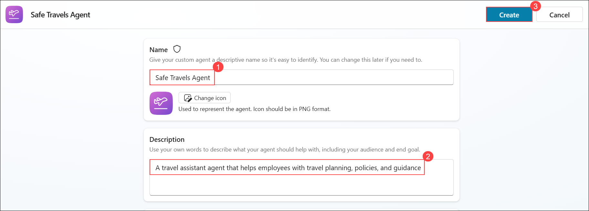

1. After clicking **Create**, verify the green success banner **"Your agent has been provisioned."** appears and the **Overview** tab loads.

   

   > **Template Benefits:** Safe Travels ships with pre-configured travel flows and knowledge, reducing setup time.

1. On **Overview (1)** click **+ Add knowledge (2)** to begin attaching internal travel policy content.

   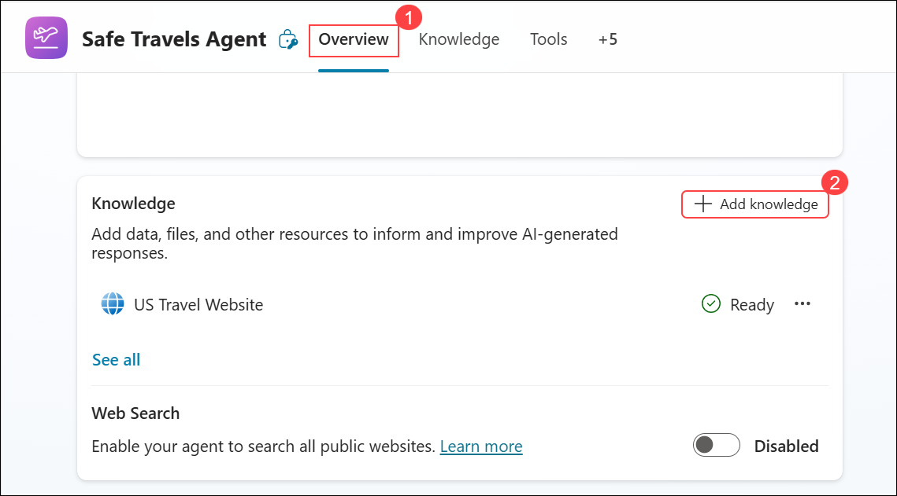

   > **Note:** Adding knowledge sources improves grounded responses; keep policy files updated for accuracy.

1. On the **Add knowledge** screen, click **select to browse** to upload a knowledge file.  

   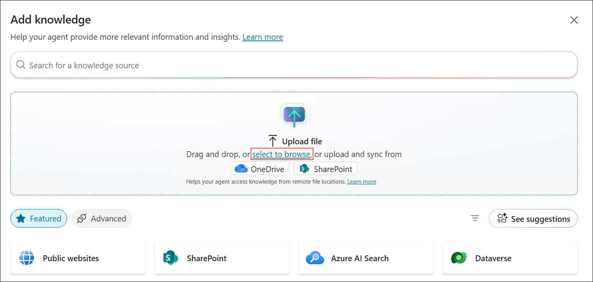

1. In the file picker window, navigate to the folder **C:\datasets\Safe-Travels-Agent-Automate (1)**, select the **Travel Policy (2)** Word document file, and then click **Open (3)**.

   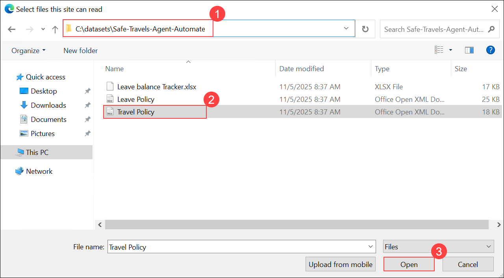

1. After the file is uploaded successfully, click **Add to agent** to include the document as a knowledge source for your agent.

      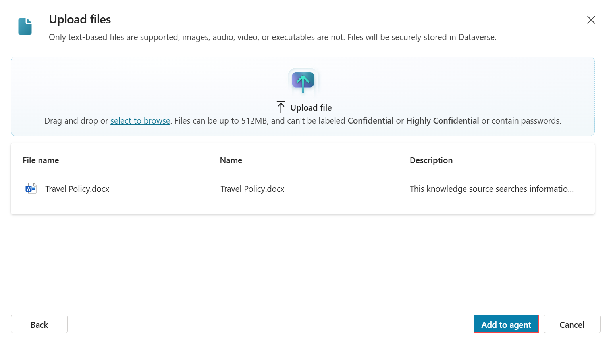

1. The system will process your agent creation. **Provisioning may take 10–15 minutes, please proceed to the next step while it completes**.

   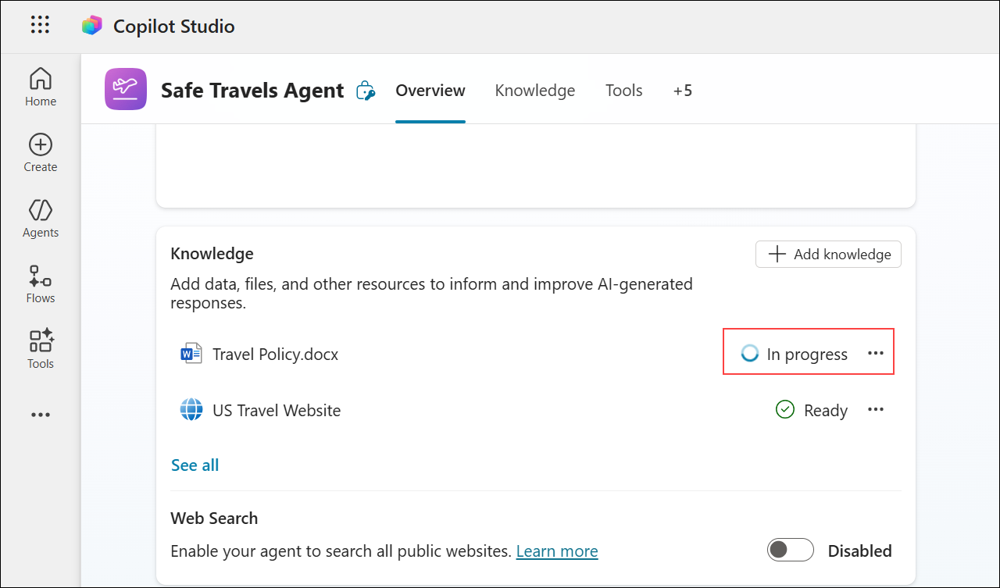

   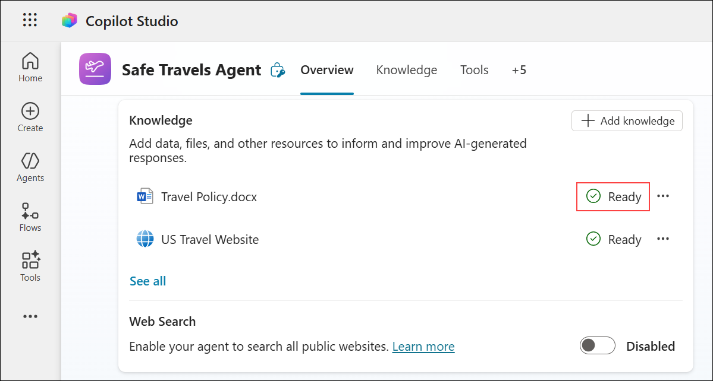

1. Navigate to **Copilot Studio**, click **Agents (1)** and then select **+ Create a Blank Agent (2)** to create the specialized Leave Manager agent.

   

   > **Note:** The Copilot Studio UI may change over time; if prompted for the agent name, enter the following:

   > ```
   > Leave Manager Agent
   > ```

1. Wait till the agent provisioning completes, click on **Edit** to configure the agent details.

      

      > **Agent Specialization:** Creating domain-specific agents allows for better accuracy, focused training, and more relevant responses for specific business functions.

1. In the next pane, enter the following details in **Name (1)** and **Description (2)** fields, and then select **Save (3)**.

   | Key | Value |
   |-----|-------|
   | Name | `Leave Manager Agent` |
   | Description | `This agent is to track the leaves of all the employees, their leave balance and leave history to approve or reject any new leave requests.` |

   

1. Once saved, scroll down and click on **Edit** on **Instructions** card.

   

1. Configure the following instruction and click on **Save** once after adding.

   | Key | Value |
   |-----|-------|
   | Instructions | `Track the leaves of employees. Track their leave balance. Apply/Reject leaves based on their balance.` |

   

1. From the **Overview (1)** tab and click **Add knowledge (2)** to include organizational data sources that will enhance your agent's leave management capabilities.

   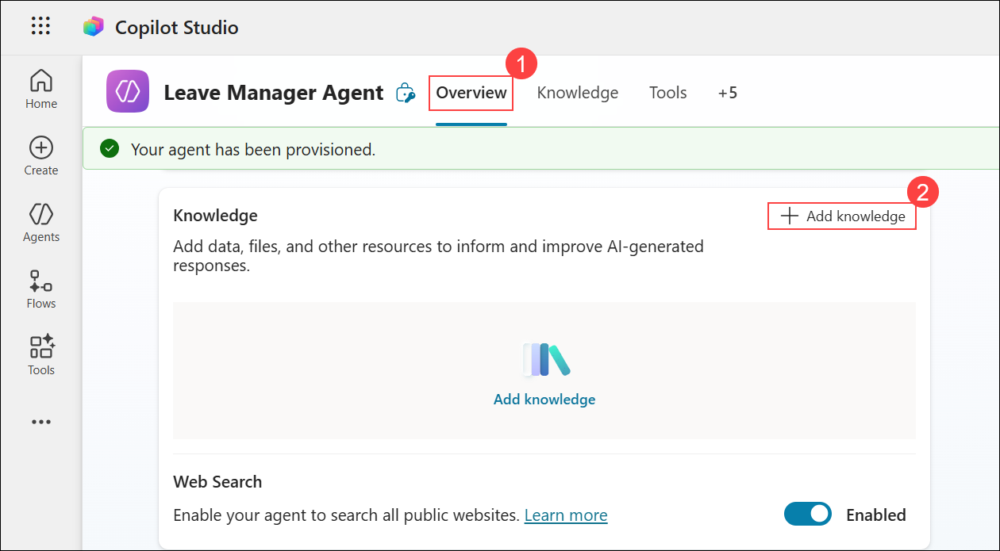

1. Click **select to browse** to upload the leave management documentation that will serve as the knowledge foundation for your agent.

   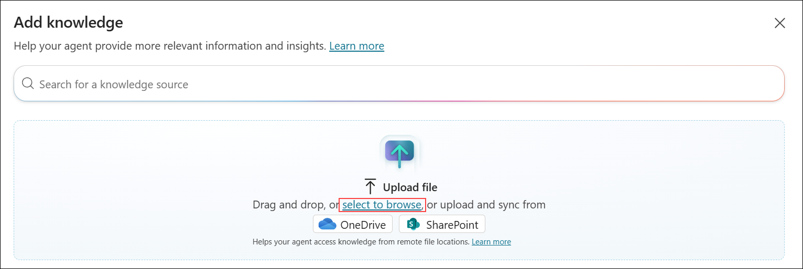

1. In the file picker window, navigate to the folder **C:\datasets\Safe-Travels-Agent-Automate (1)**, select the files **Leave balance Tracker.xlsx (2)**, and then click **Open (3)**.

   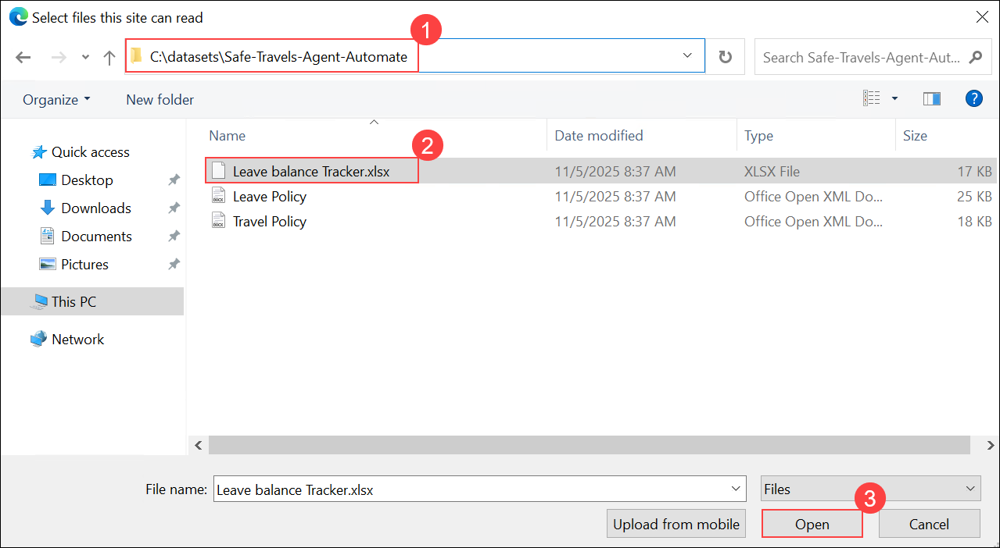

1. Upload the required leave policy and tracking files, then click **Add to agent** to integrate them as authoritative knowledge sources.

   

1. Verify that all uploaded knowledge sources display **Ready** status, confirming successful integration and availability for agent responses.

   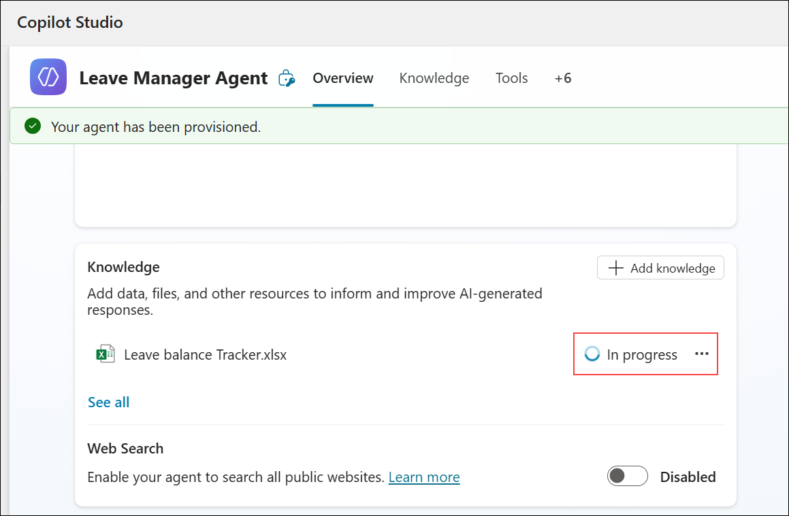

   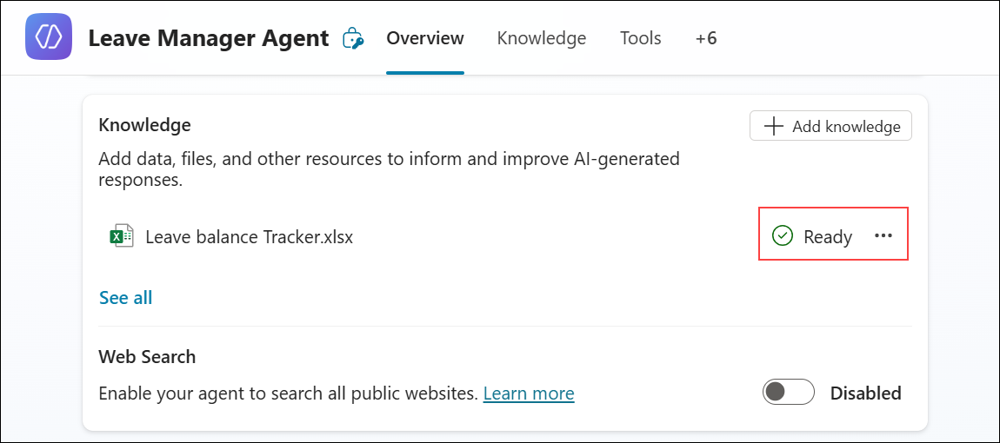

   > **Note:** It may take 10–15 minutes for all knowledge sources to show the **Ready** status. You can proceed with the next task while the processing completes.

   > **Knowledge Integration:** Successfully uploaded knowledge sources enable your agent to provide accurate, policy-compliant responses based on your organization's actual leave management data.

1. Please follow the same steps and upload **C:\datasets\Safe-Travels-Agent-Automate\Leave Policy** document.

## Task 3: Test and Validate Agent Functionality

In this task, you'll test your Safe Travels agent to validate its functionality and responses to travel-related queries.

1. From the left navigation menu, click **Agents (1)**, and then select **Safe Travels Agent (2)** from the list to open it.

   

1. Verify that the uploaded knowledge source shows the **Ready** status as highlighted.

   

   > **Note:** If the status is not yet **Ready**, you can continue with the next steps. However, the agent's responses may not reflect the latest data until the knowledge source is fully processed.

   > **Note:** It is recommended that you proceed to the next tasks and perform them. Once the knowledge source is fully processed, you can return later to retest the agent for improved and accurate responses during future interactions.

1. Click **Test** to open the test panel and verify your agent’s responses.

   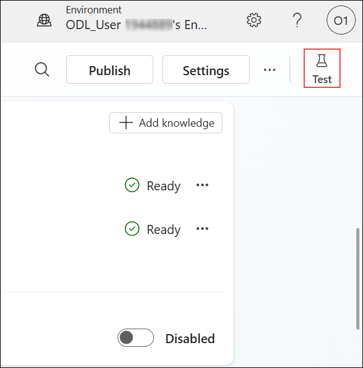

1. In the test chat, enter the following **prompt (1)** and then select **Send (2)**.

   ```
   How to apply for passport?
   ```

   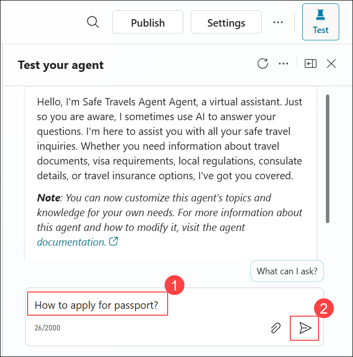

1. Verify that the **response** generated by the agent is as expected.
   
   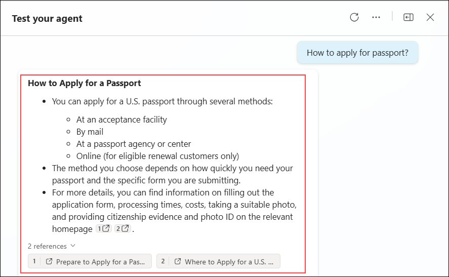

   > **Note:** The output may vary if the knowledge source (Word file) is still processing. This is expected behavior. You can continue with the next task you’ll be interacting with the agent again in the upcoming tasks once the knowledge source is fully ready.

1. In the test chat, enter the following **prompt (1)** and then select **Send (2)**.

   ```
   What is our company travel policy?
   ```

1. Verify that the **response** generated by the agent is as expected.

   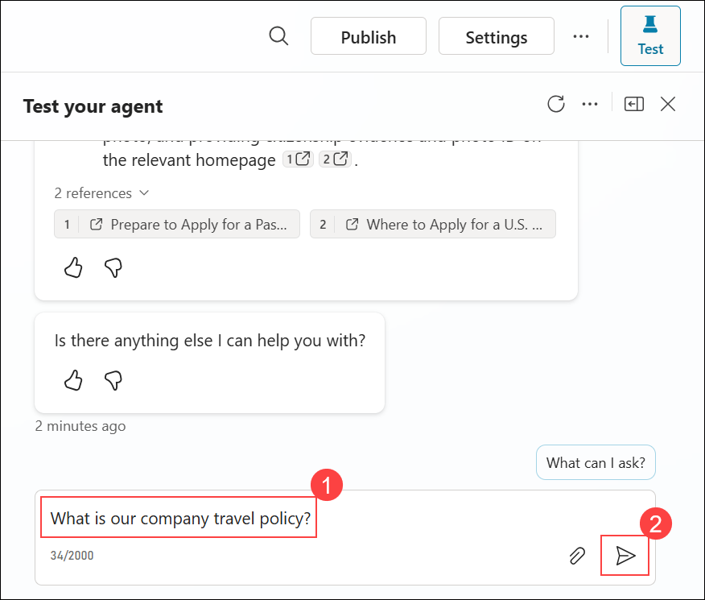
   
1. Continue testing with additional travel scenarios to ensure the agent responds appropriately to various travel-related questions.

   > **Knowledge Integration:** The agent leverages its built-in travel knowledge to provide helpful responses across various travel scenarios.

## Task 4: Publish and Deploy Agent to Microsoft Teams

In this task, you will publish your Safe Travels agent and deploy it to Microsoft Teams, making it accessible to your organization's employees.

1. After testing, click the **Publish** button in the top-right corner of the agent interface to begin the publishing process.

   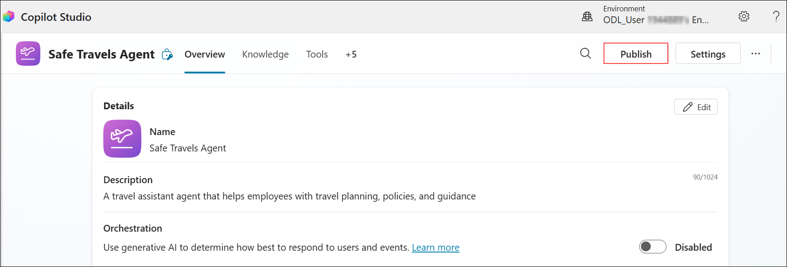

1. In the publish dialog, review the publishing details and click **Publish** to confirm and publish your agent.

   

   > **Publishing Process:** The agent will be packaged and made available for channel deployment. This process may take a few moments to complete.

1. Open a new browser tab and navigate to Microsoft Teams using the link below:

   ```
   https://teams.microsoft.com/v2/
   ``` 

1. If prompted to sign in, enter your **email address (1)** and click **Next (2)**.

   - **Email/Username:** <inject key="AzureAdUserEmail"></inject>

      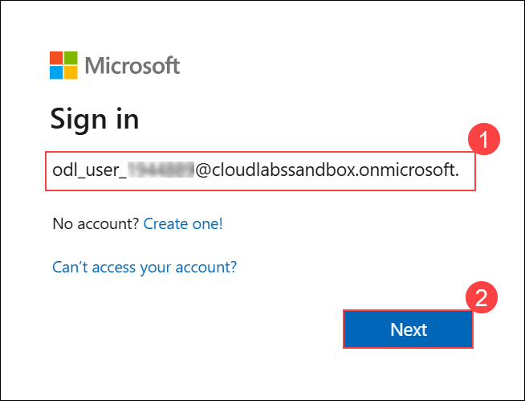

1. Enter the **Temporary Access Pass (1)** and click **Sign in (2)**.

   - **Temporary Access Pass:** <inject key="AzureAdUserPassword"></inject>

      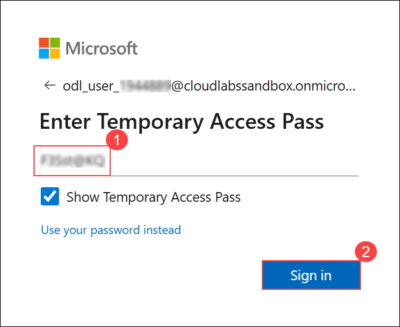

1. If you see a "Get to know Teams" welcome screen, click **Get Started** to proceed.

   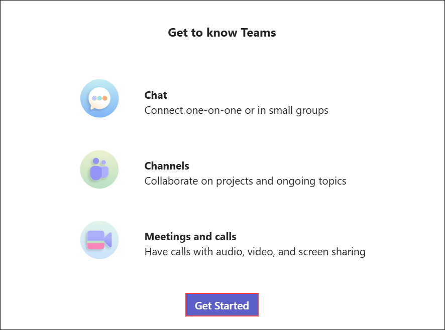

1. Once published successfully, navigate to the **Channels** section to configure deployment channels for your agent.

   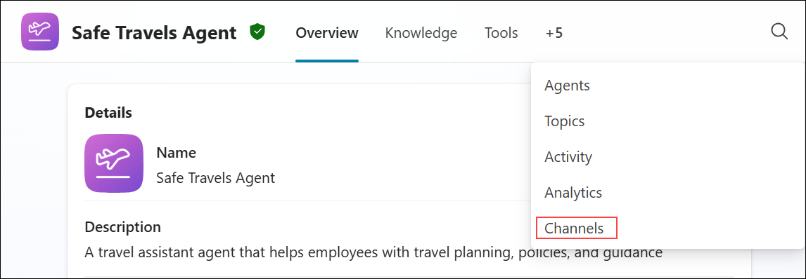

1. In the Channels interface, you'll see available deployment options. Select **Microsoft Teams** to deploy your agent to Teams.

   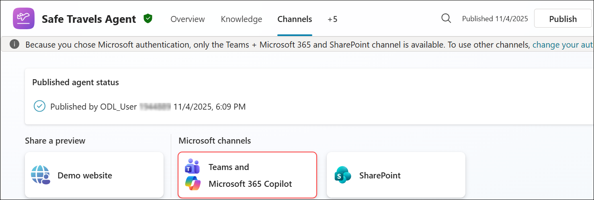

   > **Channel Benefits:** Deploying to Microsoft Teams provides users access through their familiar collaboration environment, increasing adoption and usage.

1. In the **Teams and Microsoft 365 Copilot** window, select the checkbox **Make agent available in Microsoft 365 Copilot (1)**, and then click **Add channel (2)**.

   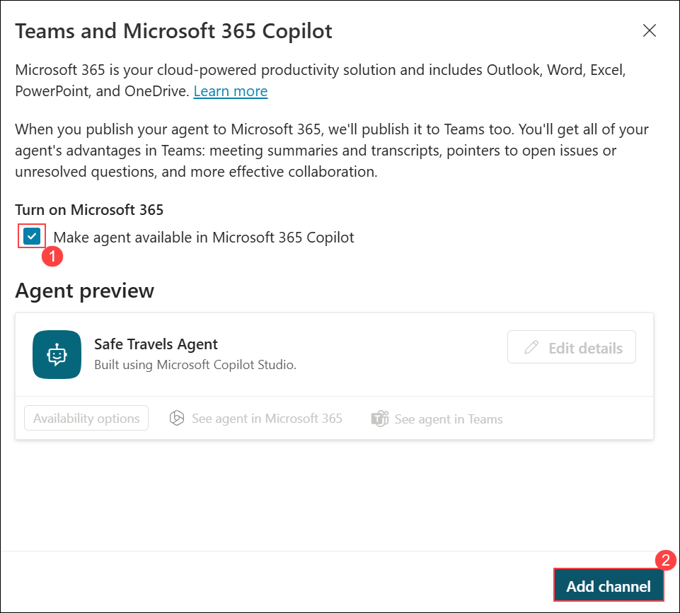

1. Once the channel is added successfully, A dialog to publish will be shown. Please click on **Publish**.

   

1. Once published, select the **See agent in Teams** option to add the agent in Teams.

   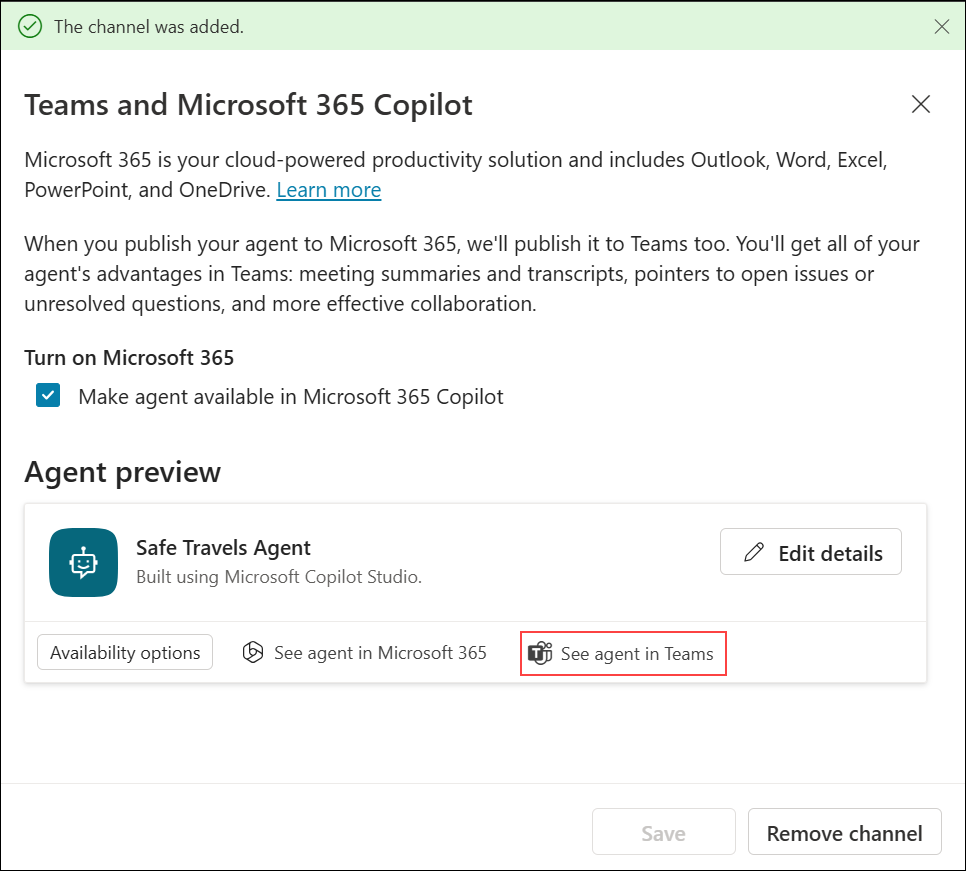

1. If prompted to download the Teams desktop app, click **Use the web app instead** to continue using Teams in your browser.

   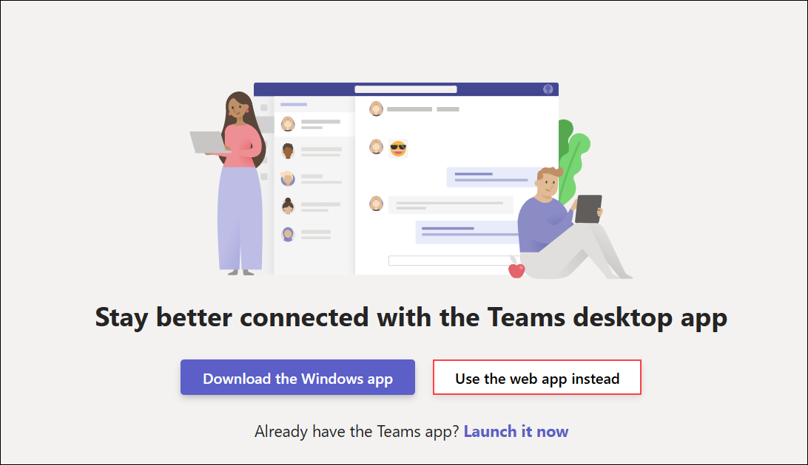

1. In the Safe Travels Agent dialog, review the agent information and click **Add** to install the agent in your Teams environment.

   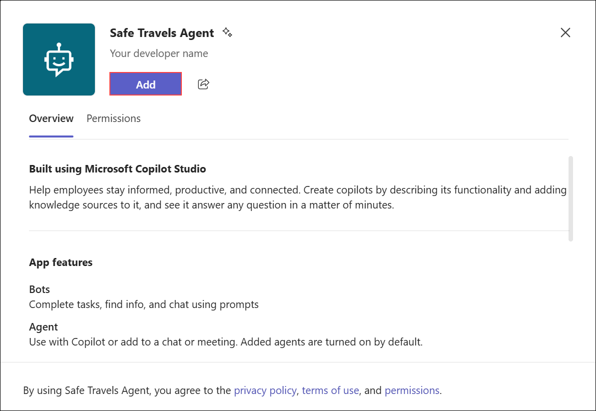

1. After successful installation, you'll see a confirmation message. Click **Open** to start using your Safe Travels Agent immediately.

   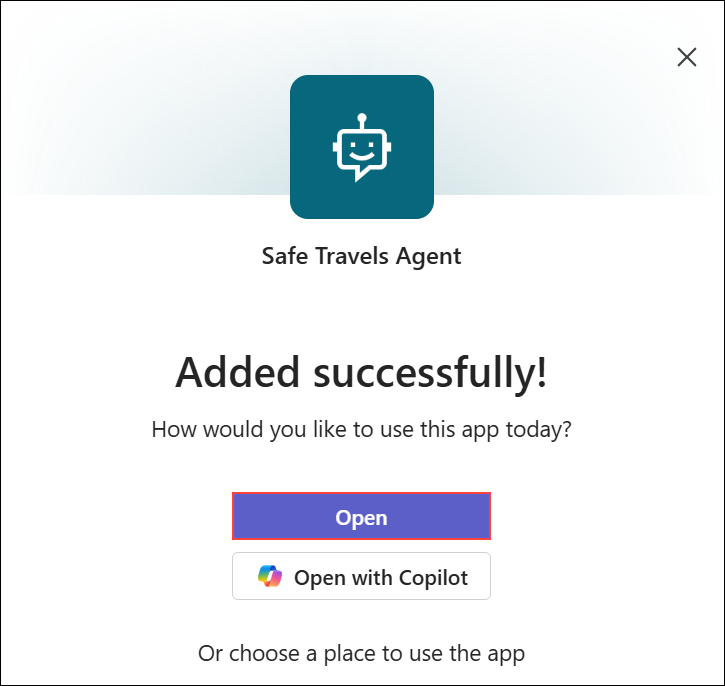

1. The Safe Travels Agent chat interface will open. Type your first message in the text box (1) and click the **Send** button (2) to test the agent.

   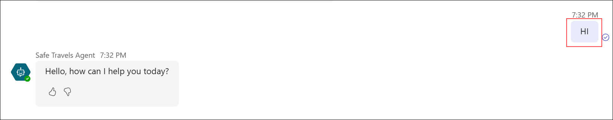

1. The **Safe Travels Agent** chat interface will open. Type your first message in the text box **(1)** and click the **Send** button **(2)**.

   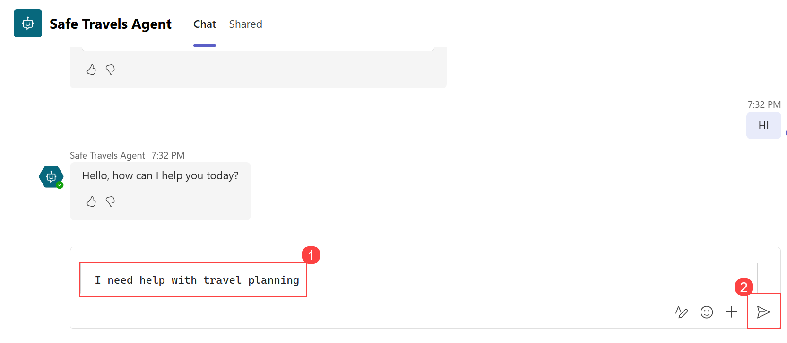

1. To start interacting with the agent. Ask a few travel-related questions and review the agent’s responses.

<validation step="93a6c432-2df0-4b2a-bea2-658266d0ac58" />
 
> **Congratulations** on completing the task! Now, it's time to validate it. Here are the steps:
> - Hit the Validate button for the corresponding task. If you receive a success message, you can proceed to the next task. 
> - If not, carefully read the error message and retry the step, following the instructions in the lab guide.
> - If you need any assistance, please contact us at cloudlabs-support@spektrasystems.com. We are available 24/7 to help.

## Summary

You've successfully:

- Imported data tables and navigated to Copilot Studio
- Created a working Safe Travels agent using Microsoft's template
- Tested the agent's travel assistance capabilities with real queries
- Published and deployed the agent to Microsoft Teams for your organization

Your Safe Travels agent is now live and ready to help employees with travel questions, passport information, and destination guidance. You've experienced the power of low-code AI development - creating enterprise-ready conversational agents without any programming.

### You have successfully completed Exercise 1. Click **Next >>** to continue to Exercise 2.
